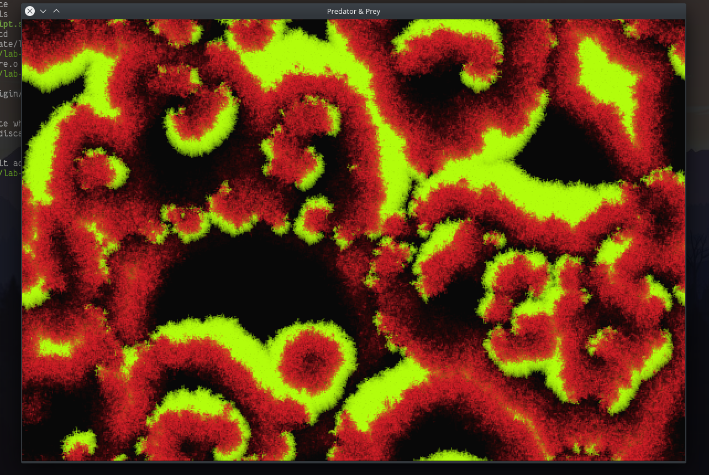
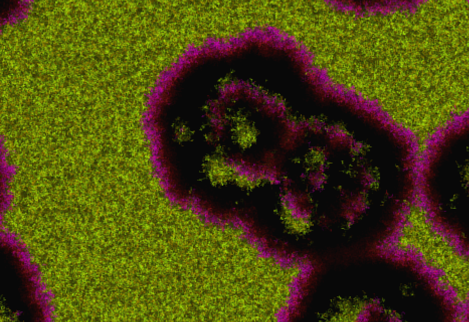

### Celular Automaton - Predator & Prey

The final goal of this automaton is to simulate a world inhabited by two types of creatures:
* predators - displayed with red
* prey - displayed with green

At each moment, every creature moves in a random direction.

Prey is rewarded for staying alive. Thus, at each moment its health rises by a certain amount. If it reached a certain treshold, the prey reproduces.

Predators are rewarded for hunting. They lose health at each moment, unless they encouter prey. In that case, the predator heals by consuming the prey and a new predator is born.

After some time, illness starts spreading and all creatures perish into nothing. 
* prey becomes orange
* predators become purple

All the creatures eventually die and the game ends.
